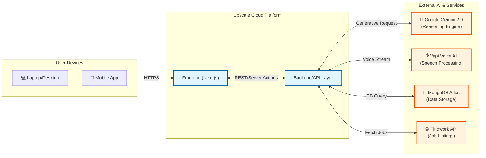
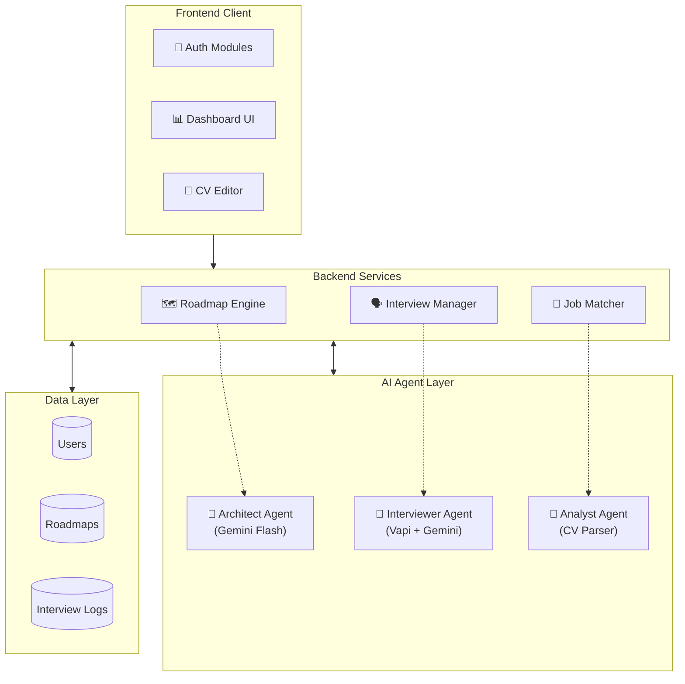
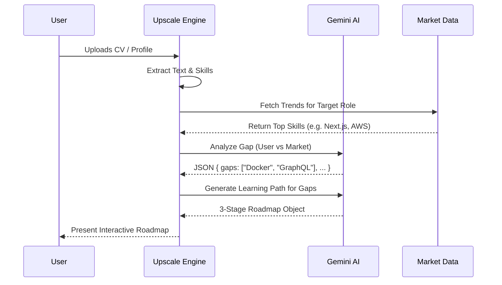
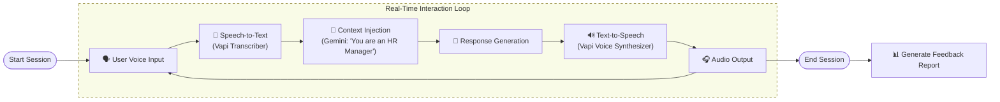

# Upscale System Diagrams (Mermaid)

Here are the Mermaid.js text-based diagrams corresponding to the visual assets. You can include these in your markdown files or render them using any Mermaid-compatible editor.

## 1. High-Level System Architecture

## 2. Component Block Diagram

## 3. Data Flow: Skill Gap Analysis

## 4. AI Pipeline: Mock Interview Loop

